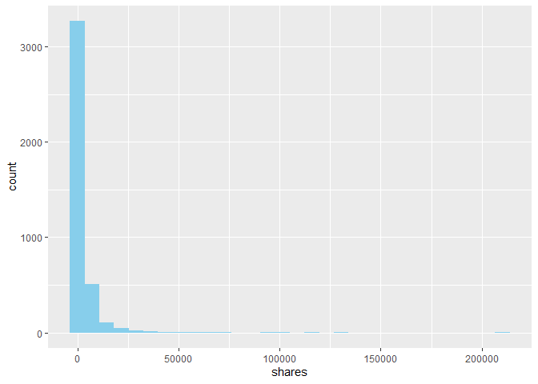
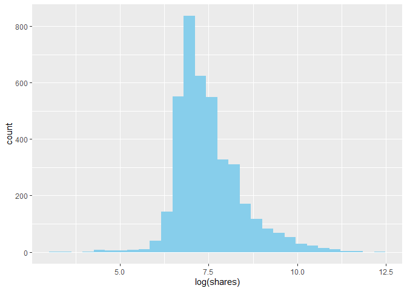
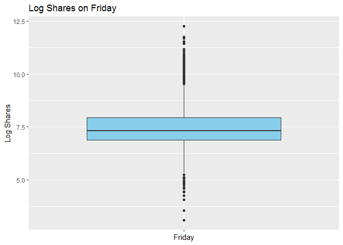
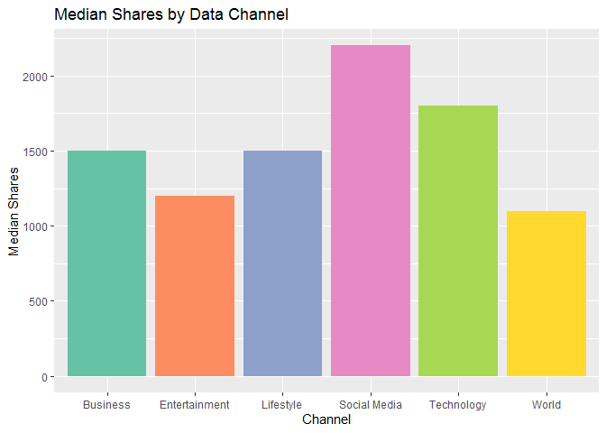

ST558 Project 2
================
David Weck
6/20/2020

  - [Introduction](#introduction)
  - [Data](#data)
  - [EDA](#eda)
  - [Modelling](#modelling)
  - [Automation](#automation)

# Introduction

The dataset I will be using for this project comes from the UC Irvine
Machine Learning Repository. It can be found
[here](https://archive.ics.uci.edu/ml/datasets/Online+News+Popularity).
It contains information about articles posted by Mashable over a 2 year
period. The target variable in the dataset is the number of shares.
There are 58 features in this dataset. These features include items like
number of words in the title, number of images in the article, polarity
scores, etc. The objective of my analysis is to use some of these
features to predict the number of shares that an article will receive.
To do this, I will be fitting one linear regression model using the
lasso and one non-linear ensemble model. I will be automating R Markdown
to create a separate analysis for each day of the week - i.e there will
be 7 different analyses: one for articles posted on Monday, one for
articles posted on Tuesday, etc.

# Data

This section loads the data, filters to selected day of the week,
removes irrelevant columns, and creates a training and a test set.

``` r
#Loading Data
news <- read_csv('OnlineNewsPopularity/OnlineNewsPopularity.csv')
#Filtering to include only data for selected day of the week
#Removing non-predictive columns, columns associated with weekday, and columns about LDA closeness
day_data <- news %>%
  filter(get(params$day) == 1) %>%
  select(3:31, 45:61)
#Creating training and testing set
#Setting seed for reproducibility
set.seed(68)
train_index <- sample(1:nrow(day_data), size = .7 * nrow(day_data))
train <- day_data[train_index, ]
train_x <- train[ , -46]
train_y <- train[ , 46]
test <- day_data[-train_index, ]
test_x <- test[ , -46]
test_y <- test[ , 46]
```

In the data section above, I removed columns 1, 2, and 32-44. Columns 1
and 2 contained the URL to the post and the number of days between when
the article was published and this dataset was generated. Both of these
columns are non predictive. Columns 32-39 contain indicator variables
for the day of the week that the article was published. Because we are
already filtering so the dataset only contains posts for a selected day
of the week, these columns become irrelevant. Finally, columns 40-44
contain LDA closeness scores for different topics. These topics are
unknown so these columns were removed for the sake of clarity.

After removing these columns, we are left with 45 features. 11 of these
features are related to words/content in the article title and/or the
article itself. The include features such as number of words in the
title/article, average word length, number of images in the article,
number of videos in the article, etc. 6 of these features are indicators
of the data channel of the article, i.e lifestyle, entertainment,
business, social media, tech, or world. 12 columns contain information
on the min, max, and average number of shares of keywords in the article
and the number of shares of other Mashable articles referenced in the
article. Finally, 16 columns contain information about the sentiment of
the article. Some of these columns include the rate of positive/negative
words, the text subjectivity, the title sentiment polarity, etc.

# EDA

This section performs some exploratory data analysis to get an overview
of the data we are working with.

``` r
#Getting summary stats of the response
summary(train_y)
```

    ##      shares        
    ##  Min.   :    22.0  
    ##  1st Qu.:   974.2  
    ##  Median :  1500.0  
    ##  Mean   :  3344.3  
    ##  3rd Qu.:  2800.0  
    ##  Max.   :210300.0

``` r
#Plotting a histogram of the response
g <- ggplot(train, aes(x = shares))
g + geom_histogram(fill = 'skyblue')
```

<!-- -->

``` r
#Response is heavily skewed, plotting histogram after log transform
g <- ggplot(train, aes(x = log(shares)))
g + geom_histogram(fill = 'skyblue')
```

<!-- -->

The first plot above shows a histogram of the target variable, shares.
We can see the number of shares is heavily skewed. The histogram of log
shares looks better. I will use log shares as the response.

``` r
#Making a boxplot of of log(shares)
h <- ggplot(train, aes(x = params$day, y = log(shares)))
h + geom_boxplot(fill = 'skyblue') +
  theme(axis.text.x = element_blank()) +
  labs(x = str_to_title(str_sub(params$day, start = 12)), y = 'Log Shares',
       title = paste('Log Shares on', str_to_title(str_sub(params$day, start = 12))))
```

<!-- -->

Since there are outliers present, I will create a training set with
outliers removed. I will fit models to the original training set and the
training set with outliers removed.

``` r
#Creating a summary table of average shares per each data channel
temp <- train %>%
  group_by(data_channel_is_bus, data_channel_is_entertainment,  #Grouping by data channel columns
           data_channel_is_lifestyle, data_channel_is_socmed, 
           data_channel_is_tech, data_channel_is_world) %>%
  summarize(med_shares = median(shares)) %>%                      #Creating summary stat
  gather(1:6, key = 'channel', value = 'indicator') %>%         #Creating categorical Channel column
  filter(indicator == 1)                                        #Filtering to include necessary rows
#Creating a bar chart of median shares per channel
j <- ggplot(temp, aes(x = channel, y = med_shares))
j + geom_bar(aes(fill = channel), stat = 'identity', show.legend = FALSE) +
  scale_x_discrete(labels = c('Business', 'Entertainment', 'Lifestyle', 
                              'Social Media', 'Technology', 'World' )) +
  scale_fill_brewer(palette = 'Set2') +
  labs(title = 'Median Shares by Data Channel', x = 'Channel', y = 'Median Shares')
```

<!-- -->

The plot above shows of the median shares per channel for Friday.

# Modelling

As mentioned above, I will be fitting a linear regression model and a
random forest. The untransformed response is quite skewed so I will be
using log shares as the target variable. I will be fitting each model to
both the full dataset and the dataset with outliers removed and
selecting the best based on the mean squared error of prediction on a
test set.

To fit the models, I will use the `caret` package. This package is very
useful because it trains models over different combinations of tuning
parameters and then selects the best model. To select the best model, I
will be using repeated 10-fold cross-validation. This method repeats
cross-validation of the training set for different tuning parameters and
selects the model with the lowest RMSE as the best.

First, I will create a dataset with the outliers removed.

``` r
#Removing outliers using 1.5 * IQR method
Q3 <- quantile(log(train$shares), .75)
Q1 <- quantile(log(train$shares), .25)
IQR <- Q3 - Q1
upper <- Q3 + 1.5 * IQR
lower <- Q1 - 1.5 * IQR

outliers <- which(log(train$shares) > upper | log(train$shares) < lower)

train_no_outliers <- train[-outliers, ]
train_x_no_outliers <- train_x[-outliers, ]
train_y_no_outliers <- train_y[-outliers, ]
```

Next, I will fit a linear regression model using stepwise selection.
Repeated cross-validation will select the best number of variables to
include in the model.

``` r
#Setting up repeated cross-validation
control <- trainControl(method = 'repeatedcv', number = 10, repeats = 2)

#Setting up tuning parameter grid
grid <- expand.grid(nvmax = 1:(ncol(train) - 1))

#Preprocess training and test set
pp <- preProcess(train_x, c('center', 'scale'))
train_x_pp <- predict(pp, train_x)
test_x_pp <- predict(pp, test_x)

#Training model on full dataset
stepwise_mod <- train(train_x_pp, log(train$shares),
                    method = 'leapSeq',
                    tuneGrid = grid,
                    trControl = control)

#Preprocessing dataset with outliers removed
pp_no_outliers <- preProcess(train_x_no_outliers, c('center', 'scale'))
train_x_no_outliers_pp <- predict(pp_no_outliers, train_x_no_outliers)

#Training model on full dataset
stepwise_mod2 <- train(train_x_no_outliers_pp, log(train_no_outliers$shares),
                    method = 'leapSeq',
                    tuneGrid = grid,
                    trControl = control)

#Generating predictions from each model
log_preds <- predict(stepwise_mod, newdata = test_x_pp)
log_preds2 <- predict(stepwise_mod2, newdata = test_x_pp)

#Calculating test MSE
(stepwise_MSE <- mean((log(test$shares) - log_preds) ^ 2))
```

    ## [1] 0.7485064

``` r
(stepwise_MSE2 <- mean((log(test$shares) - log_preds2) ^ 2))
```

    ## [1] 0.7373676

The model fit on the full dataset has lower test MSE. This is the better
of the two models.

Next, I will fit a random forest to both the dataset. Then, we will
compare the test MSE from the random forest to that of the stepwise
selection model. The model with the lowest test MSE will be considered
as the best.

``` r
#Will utilize same repeated cross validation 

#Setting up parameter grid
grid <- expand.grid(mtry = as.integer(sqrt(ncol(train))))

#Training random forest on full dataset
rf_mod <- train(train_x, log(train$shares),
                 method = 'rf',
                 tuneGrid = grid,
                 trControl = control)

#Training random forest on full dataset
rf_mod2 <- train(train_x_no_outliers, log(train_no_outliers$shares),
                 method = 'rf',
                 tuneGrid = grid,
                 trControl = control)

#Generating predictions
rf_log_preds <- predict(rf_mod, newdata = test_x)
rf_log_preds2 <- predict(rf_mod2, newdata = test_x)

#Calculating test MSE
(rf_MSE <- mean((log(test$shares) - rf_log_preds) ^ 2))
```

    ## [1] 0.6894781

``` r
(rf_MSE2 <- mean((log(test$shares) - rf_log_preds2) ^ 2))
```

    ## [1] 0.7033891

Again the model fit on the full data outperforms the model with outliers
removed.

The MSE of the best random forest model is lower than that of the best
stepwise selection model. This means the random forest fit on the full
dataset is the best of all the models.

This is not surprising because we can usually expect a flexible ensemble
method like a random forest to perform better than a linear method in
cases like this.

# Automation

The code below sets up automation of these reports so that a different
report is produced for each day of the week.

``` r
days <- c('monday', 'tuesday', 'wednesday', 'thursday', 'friday', 'saturday', 'sunday')

day_list <- paste('weekday', 'is', days, sep = '_')

output_files <- paste0(str_to_title(days), 'Analysis.md')

params_list <- lapply(day_list, FUN = function(x){list(day = x)})

reports <- tibble(output_files, params_list)
```

After running the code above, run the following code in the console to
knit this document for each day of the week

``` r
apply(reports, MARGIN = 1, 
            FUN = function(x){
                render(input = "SharesPrediction.Rmd", output_file = x[[1]], params = x[[2]])
                })
```
